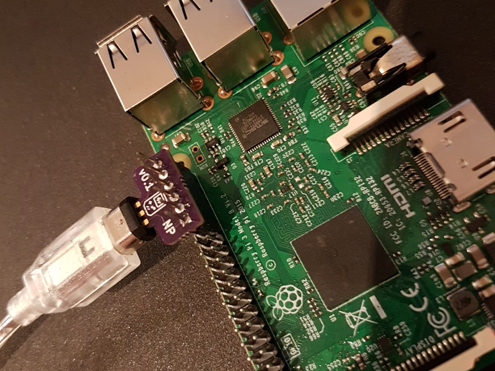

# Gameboy Cartridge Dumper - Listener

This is code to run on a Raspberry Pi to connect to a Gameboy via a 
[link cable breakout board](https://github.com/Palmr/gb-link-cable) and wait for data from the 
[cart-dumper ROM](https://github.com/Palmr/cart-dumper).

## TODO

- [x] Get GPIO code working on the gameboy
- [x] Add non-blocking ncurses escape to endless loop so file could be written outside
- [ ] Parse inbound cart header data to show the ROM details
- [ ] Do checksum in the header to see if we got malformed data
- [ ] Implement some form of data redundancy
  - [ ] Get bytes multiple times, respond with an outbound byte if they all match?
  - [ ] Hamming codes

## To Build

Have [WiringPi](http://wiringpi.com/) installed on your Raspberry Pi, ncurses, gcc and make. Then just run `make` in this folder.

## To Use

- Start the Gameboy running the cart-dumper ROM
- Connect it to the gameboy with a breakout board connected to pins 29-39
  - 
- Start the listener on the Raspberry Pi
- Perform a dump [following instructions for the ROM](https://github.com/Palmr/cart-dumper#to-use)
- When the dump is complete press Escape in the listener terminal window
